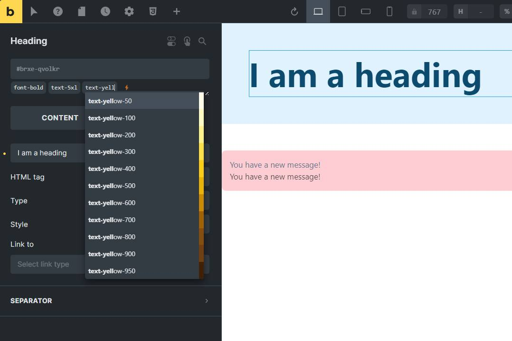

# Yabe Open Source - Bricks Plain Classes

    <a aria-label="GitHub release (latest by date including pre-releases)" href="https://github.com/yabe-open-source/bricks-plain-classes/releases">
        <picture>
            
        </picture>
    </a>
    <a aria-label="GitHub Sponsors" href="https://github.com/sponsors/suabahasa">
        <picture>
            
        </picture>
    </a>
    <a aria-label="Support me on Ko-fi" href="https://ko-fi.com/Q5Q75XSF7">
        <picture>
            
        </picture>
    </a>
    <a aria-label="Join Our Facebook community" href="https://www.facebook.com/groups/1142662969627943">
        <picture>
            
        </picture>
    </a>

Add the ability to write plain CSS classes to Bricks elements without adding the class to the Global Class database.

The auto-complete feature, you can quickly add the class from your favorite CSS framework such as [Yabe Siul (Tailwind CSS)](https://siul.yabe.land), [Core Framework](https://coreframework.com), [Automatic.css (ACSS)](https://automaticcss.com), [Master CSS](https://css.master.co), [Bootstrap](https://getbootstrap.com), even your own custom CSS classes.

Equipped with a quick class preview feature, you can quickly preview the CSS classes in the Bricks editor by hovering over the class name or navigating with your keyboard without adding the class to the element.

## Installation

1. Download the plugin zip file
2. Install the plugin by uploading the zip file
3. Activate the plugin

## Usage

1. Open the Bricks editor
2. Select an element
3. The `⚡️` emoji is visible on the panel where you can start typing the class name

## Auto-complete

- **[Tailwind CSS](https://tailwindcss.com)**: built-in. provided by the [Yabe Siul](https://rosua.org/downloads/yabe-siul) plugin

- **[Core Framework](https://coreframework.com)**: built-in
- **[Automatic.css (ACSS)](https://automaticcss.com)**: built-in
- **[Master CSS](https://css.master.co)**: provided by the [Yabe Open Source - Bricks Master CSS](https://github.com/yabe-open-source/bricks-master-css) plugin
- **[Bootstrap 5](https://getbootstrap.com)**: available as a snippet code https://github.com/yabe-open-source/bricks-plain-classes/discussions/2
- **[Bricks Global Classes](https://bricksbuilder.io/)**: available as a snippet code https://github.com/yabe-open-source/bricks-plain-classes/discussions/3

## License

[GPL-3.0](./LICENSE)

## Credits

- [Vue.js](https://vuejs.org)
- [highlight-in-textarea](https://github.com/masterWeber/highlight-in-textarea)
- [Tribute](https://github.com/zurb/tribute)
- [autosize](https://github.com/jackmoore/autosize)